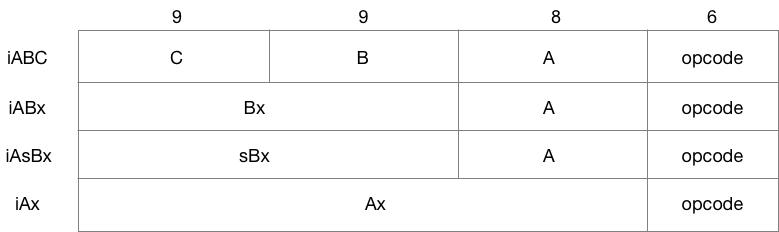

# Bytecode

Lua use a 32-bit register-based instructions with the following possible format:



Most of the instructions are under the **iABC** format, with the following exceptions:

* **iABx**: `LOADK`, `LOADKX`, `CLOSURE`
* **iAsBx**: `JMP`, `FORLOOP`, `TFORLOOP`
* **iAx**: `EXTRAARG`

The format of each instruction is defined in `lopcode.c`:

```c
/*
** masks for instruction properties. The format is:
** bits 0-1: op mode
** bits 2-3: C arg mode
** bits 4-5: B arg mode
** bit 6: instruction set register A
** bit 7: operator is a test (next instruction must be a jump)
*/

enum OpArgMask {
  OpArgN,  /* argument is not used */
  OpArgU,  /* argument is used */
  OpArgR,  /* argument is a register or a jump offset */
  OpArgK   /* argument is a constant or register/constant */
};

#define opmode(t,a,b,c,m) (((t)<<7) | ((a)<<6) | ((b)<<4) | ((c)<<2) | (m))

LUAI_DDEF const lu_byte luaP_opmodes[NUM_OPCODES] = {
/*       T  A    B       C     mode		   opcode	*/
  opmode(0, 1, OpArgR, OpArgN, iABC)		/* OP_MOVE */
 ,opmode(0, 1, OpArgK, OpArgN, iABx)		/* OP_LOADK */
 ,opmode(0, 1, OpArgN, OpArgN, iABx)		/* OP_LOADKX */
 ,opmode(0, 1, OpArgU, OpArgU, iABC)		/* OP_LOADBOOL */
 ,opmode(0, 1, OpArgU, OpArgN, iABC)		/* OP_LOADNIL */
 ,opmode(0, 1, OpArgU, OpArgN, iABC)		/* OP_GETUPVAL */
 ,opmode(0, 1, OpArgU, OpArgK, iABC)		/* OP_GETTABUP */
 ,opmode(0, 1, OpArgR, OpArgK, iABC)		/* OP_GETTABLE */
// ...
```


## References

* [A No-Frills Introduction to Lua 5.1 VM Instructions](http://luaforge.net/docman/83/98/ANoFrillsIntroToLua51VMInstructions.pdf)
* [Lua 5.3 Bytecode Reference](https://the-ravi-programming-language.readthedocs.io/en/latest/lua_bytecode_reference.html)
